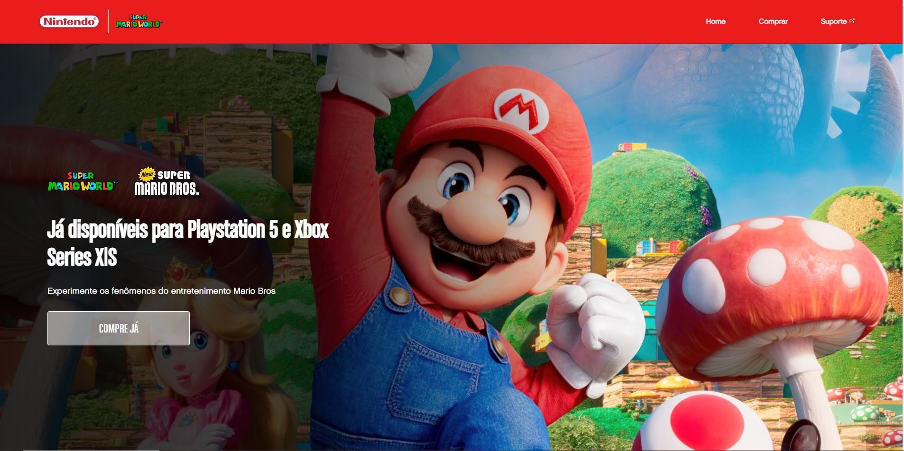

  

  

## 💻 Projeto

Este projeto é material das aulas do DevEmDobro que ensina a como criar uma **Landing Page** utilizando tecnologias como _HTML_, _CSS_ e _JavaScript_.

Acesso ao projeto em https://cayotarcisio.github.io/projectMario/

## 🚀 Tecnologias

- HTML
- CSS
- JavaScript

## 📔 Conhecimentos abordados

- [x] Uso semântico do HTML
- [x] Uso do CSS Flexbox
- [x] Carregamento de fonte externa
- [x] Design reponsivo para dispositivos móveis

